# Sử dụng GitHub để lưu trữ ảnh cho tài liệu

## 1. Tổng quan

Tài liệu này hướng dẫn các kiến thức cơ bản để giúp sử dụng GitHub làm nơi lưu trữ tài nguyên (ảnh, checklist, biểu mẫu, protocol...) làm tài liệu tham khảo cho sách. Người đọc sách sẽ được chỉ dẫn để tìm đến các tài nguyên này trên internet (được lưu trữ trên GitHub).

Nội dung file này có thể được access thông qua GitHub page [https://phamthiloc.github.io/HuongDanVietSach/](https://phamthiloc.github.io/HuongDanVietSach/).

## 2. Khái niệm

### 2.1. Khái niệm về git

Git là một hệ thống quản lý phiên bản (version control system) - giống như một "hồ sơ bệnh án điện tử" cho các file và thư mục trên máy tính. Hãy tưởng tượng Git như một hệ thống lưu trữ thông minh giúp bạn:

**Tác dụng của Git:**
- **Lưu trữ lịch sử thay đổi**: Giống như bác sĩ ghi chép từng bước điều trị, Git ghi lại mọi thay đổi trong file
- **Làm việc nhóm**: Nhiều người có thể cùng làm việc trên cùng một dự án mà không bị xung đột
- **Sao lưu an toàn**: Dữ liệu được lưu trữ ở nhiều nơi, giảm thiểu rủi ro mất mát
- **Quay lại phiên bản cũ**: Có thể khôi phục về bất kỳ thời điểm nào trong quá khứ

**Khái niệm Repository:**
- **Repository (Kho lưu trữ)**: Là nơi chứa tất cả file và thư mục của dự án, cùng với lịch sử thay đổi
- **Local Repository**: Repository được lưu trữ trên máy tính cá nhân của bạn
- **Remote Repository (GitHub)**: Repository được lưu trữ trên internet (máy chủ của GitHub), có thể truy cập từ bất kỳ đâu

**Các khái niệm cơ bản:**
- **Clone**: Sao chép toàn bộ repository từ GitHub về máy tính của bạn (giống như tải về một bộ hồ sơ hoàn chỉnh)
- **Pull**: Cập nhật dữ liệu mới nhất từ GitHub về máy tính (giống như đồng bộ hóa hồ sơ mới nhất)
- **Commit**: Lưu lại những thay đổi bạn đã thực hiện (giống như ghi chép vào hồ sơ bệnh án)
- **Push**: Gửi những thay đổi từ máy tính lên GitHub (giống như cập nhật hồ sơ lên hệ thống chung)

**Sơ đồ làm việc:**

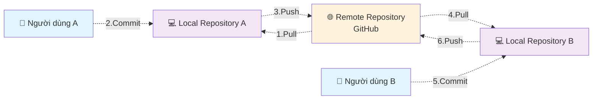
```mermaid
graph LR
    RepoA[💻 Local Repository A]
    GitHub[🌐 Remote Repository<br/>GitHub]
    RepoB[💻 Local Repository B]
    
    UserA[👤 Người dùng A]
    UserB[👤 Người dùng B]
    
    GitHub -.->|1.Pull| RepoA
    UserA -.->|2.Commit| RepoA
    RepoA -.->|3.Push| GitHub
    GitHub -.->|4.Pull| RepoB
    UserB -.->|5.Commit| RepoB
    RepoB -.->|6.Push| GitHub
    
    style UserA fill:#e1f5fe
    style UserB fill:#e1f5fe
    style RepoA fill:#f3e5f5
    style RepoB fill:#f3e5f5
    style GitHub fill:#fff3e0
```

Khi bạn thay đổi file trên máy tính, bạn "commit" để lưu lại. Sau đó "push" lên GitHub để chia sẻ với người khác. Người khác sẽ "pull" về để có được phiên bản mới nhất.


### 2.2. Khái niệm về Github

GitHub là một nền tảng lưu trữ và chia sẻ code trên internet - giống như một "thư viện y khoa trực tuyến" cho các dự án phần mềm và tài liệu. Hãy tưởng tượng GitHub như một kho lưu trữ khổng lồ trên internet:

**GitHub là gì:**
- **Nền tảng lưu trữ**: GitHub cung cấp không gian lưu trữ miễn phí cho các dự án của bạn trên internet
- **Cộng đồng chia sẻ**: Hàng triệu người trên thế giới sử dụng GitHub để chia sẻ và hợp tác
- **Giao diện web**: Bạn có thể truy cập GitHub qua trình duyệt web, không cần cài đặt phức tạp
- **Miễn phí**: Dịch vụ cơ bản hoàn toàn miễn phí cho cá nhân và dự án công khai

**Tại sao sử dụng GitHub:**
- **Lưu trữ an toàn**: Dữ liệu được lưu trữ trên máy chủ của Microsoft (chủ sở hữu GitHub), đảm bảo an toàn
- **Truy cập mọi lúc**: Có thể truy cập từ bất kỳ máy tính nào có internet
- **Chia sẻ dễ dàng**: Chỉ cần gửi link, người khác có thể xem và tải về
- **Làm việc nhóm**: Nhiều người có thể cùng làm việc trên cùng một dự án
- **Lịch sử đầy đủ**: Mọi thay đổi đều được ghi lại, có thể xem lại bất kỳ lúc nào

**So sánh với Git:**
- **Git**: Là công cụ quản lý phiên bản (như phần mềm quản lý hồ sơ bệnh án)
- **GitHub**: Là nơi lưu trữ và chia sẻ (như thư viện y khoa trực tuyến)

GitHub sử dụng Git làm nền tảng, nhưng cung cấp thêm nhiều tính năng như giao diện web, quản lý dự án, và cộng đồng chia sẻ.

### 2.3. Viết tài liệu với Markdown

Markdown là một ngôn ngữ đánh dấu đơn giản để viết tài liệu - giống như một "hệ thống ghi chép thông minh" giúp bạn tạo ra văn bản có cấu trúc rõ ràng. Markdown được sử dụng rộng rãi trên GitHub để viết tài liệu hướng dẫn.

**Markdown là gì:**
- **Ngôn ngữ đánh dấu**: Một cách viết văn bản với các ký hiệu đặc biệt để tạo định dạng
- **Đơn giản**: Dễ học, dễ viết, không cần phần mềm phức tạp
- **Phổ biến**: Được sử dụng rộng rãi trên GitHub, các diễn đàn, và blog
- **Tương thích**: Có thể chuyển đổi thành nhiều định dạng khác (HTML, PDF...)

**Tại sao sử dụng Markdown:**
- **Dễ đọc**: Ngay cả khi chưa được hiển thị, văn bản vẫn dễ đọc
- **Dễ viết**: Không cần chuột, chỉ cần bàn phím
- **Nhất quán**: Hiển thị giống nhau trên mọi nền tảng
- **Hỗ trợ tốt**: GitHub hiển thị Markdown đẹp và chuyên nghiệp

**Lưu ý khi sử dụng trên GitHub:**
- File Markdown có đuôi `.md` (ví dụ: `README.md`)
- GitHub tự động hiển thị file README.md khi mở repository
- Có thể xem trước kết quả khi viết trên GitHub
- Hỗ trợ emoji và bảng biểu

Hãy xem thêm "Các ký hiệu cơ bản của Markdown" trong phần phụ lục.

### 2.4. Vẽ hình trong Markdown với Mermaid

Mermaid là một công cụ vẽ sơ đồ bằng văn bản - giống như một "hệ thống vẽ sơ đồ thông minh" giúp bạn tạo ra các biểu đồ, sơ đồ từ những dòng chữ đơn giản. Mermaid được hỗ trợ trực tiếp trên GitHub.

**Mermaid là gì:**
- **Vẽ sơ đồ bằng văn bản**: Thay vì dùng chuột vẽ, bạn viết các dòng lệnh để tạo sơ đồ
- **Tự động hiển thị**: GitHub tự động chuyển đổi văn bản thành hình ảnh đẹp
- **Dễ chỉnh sửa**: Chỉ cần sửa văn bản, sơ đồ sẽ tự động cập nhật
- **Chuyên nghiệp**: Tạo ra các sơ đồ có chất lượng cao, phù hợp cho tài liệu

Mermaid giúp bạn tạo ra các sơ đồ chuyên nghiệp mà không cần kỹ năng vẽ hay phần mềm phức tạp.

Hãy xem thêm "Các ký hiệu cơ bản của Mermaid" trong phần phụ lục.

### 2.5. GitHub Desktop

GitHub Desktop là phần mềm giúp clone, pull, commit, push data lên GitHub một cách thuận tiện.

Chi tiết cách cài đặt và sử dụng GitHub Desktop, xem *Cài đặt GitHub Desktop* trong phần Phụ lục.

### 2.6. Phần mềm soạn thảo Markdown miễn phí

Để soạn thảo file Markdown một cách thuận tiện, bạn có thể sử dụng các phần mềm editor miễn phí sau đây. Tất cả đều có chế độ preview (xem trước) và hoạt động tốt trên cả Windows và macOS:

**1. MarkText**
- **Ưu điểm**: Miễn phí hoàn toàn, mã nguồn mở
- **Chế độ preview**: WYSIWYG
- **Tính năng**: Hỗ trợ nhiều định dạng xuất (PDF, HTML)
- **Phù hợp cho**: Người muốn phần mềm mã nguồn mở
- **Download**: [MarkText](https://marktext.app/)

**2. Visual Studio Code (VS Code)**
- **Ưu điểm**: Miễn phí, mạnh mẽ, có nhiều extension hỗ trợ
- **Chế độ preview**: Có thể xem trước Markdown ngay trong editor
- **Tính năng**: Tự động hoàn thành, kiểm tra lỗi, hỗ trợ Git
- **Phù hợp cho**: Người mới bắt đầu đến chuyên nghiệp
- **Download**: [Visual Studio Code](https://code.visualstudio.com/)

## 3. Quy trình làm việc với github

* Bước đầu: Clone repository.
  Chỉ cần làm một lần.
* Mỗi lần làm việc:
  * Pull data: Lấy data mới nhất từ GitHub.com về máy tính.
  * Thay đổi data (thay đổi nội dung, hình ảnh, file...).
  * Commit data: Lưu những thay đổi vào trong repository trên máy tính.
  * Push data: Đẩy những thay đổi đã lưu trong repository trên máy tính lên GitHub.com.
* Ngoài ra, sẽ cần biết thêm khái niệm Merge và xử lý xung đột Conflict (khi nội dung do ta sửa phát sinh xung đột với nội dung do người khác sửa).

Xem thêm "Commit và Push" trong phần Phụ lục.

## 4. Quy tắc đặt tên file ảnh

Tên file ảnh: chia vào các thư mục `<Nhóm việc>/<number>_<Chú thích>.<extension>`

* **<Nhóm việc>** là dễ phân tách các file ảnh theo nội dung sách, cho dễ quản lý.
* **<number\>** là số thứ tự, theo thứ tự xuất hiện trong sách. Cái này chỉ cần tính tương đối, không cần chặt chẽ (ví dụ trong tương lai ta có thể chèn thêm các ảnh vào cùng số thứ tự 04).
* **<Chú thích>** là từ gợi nhớ để ta dễ hiểu nội dung ảnh mà không cần mở nó ra. Nên đặt tên file kiểu CamelCase (viết hoa chữ đầu của từ).
* **<extension\>** là đuôi file ảnh, ví dụ như: jpg, jpeg, png…

Ví dụ
* CreateRepository/00_Button.png
* CreateRepository/01_InputInfo.png
* CreateRepository/02_Complete.png
* GitHubDesktop/01_Download.png
* GitHubDesktop/02_DownloadNow.png
* GitHubDesktop/03_DownloadForWindows.png

## 5. Làm việc với Github

### 5.1. Tạo repository

Với mỗi một dự án/quyển sách, chúng ta tạo cho nó một repository.
Chi tiết xem trong phần "Tạo repository trên GitHub.com" trong Phụ lục.

### 5.2. Clone repository về máy tính

Chi tiết về việc clone repository từ GitHub.com về máy tính, xem nội dung "Clone repository" trong Phụ lục.

* Trong thư mục được clone về, có thư mục .git. Ta không nên động vào các file trong thư mục này, cũng không được xóa nó.
* Sau khi đã clone repository, ta cần tạo ít nhất là 2 file *LICENSE* và *README\.md*
  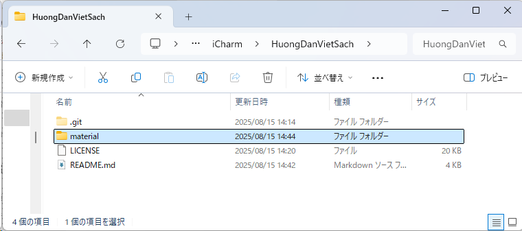

### 5.3. Tạo file LICENSE

Nên tạo file LICENSE để tạo cơ sở pháp lý bảo về quyền sở hữu của mình trước các tranh chấp trong tương lai.

Với các tài liệu viết sách, ta nên lựa chọn giấy phép *Creative Commons Attribution-NonCommercial-NoDerivatives* (CC BY-NC-ND).

Xem nội dung chi tiết về giấy phép CC BY-NC-ND trong phụ lục.

### 5.4. Tạo file README\.md

File *README\.md* là file được tự động hiển thị lên mỗi khi ta mở một thư mục trên GitHub. Ta nên để các hướng dẫn tổng quan liên quan đến các nội dung chứa trong thư mục này trong file README\.md.

### 5.5. Thiết lập GitHub page

TBD

## 6. Tạo QR code

Để tạo QR code cho URL của GitHub repository, giúp người đọc dễ dàng truy cập tài liệu, bạn có thể sử dụng các dịch vụ và phần mềm miễn phí sau đây. Tất cả đều tạo QR code thuần, không có redirect:

**1. Dịch vụ Online miễn phí:**

**QR Code Generator (qr-code-generator.com):**
- **Ưu điểm**: Miễn phí hoàn toàn, không redirect, không watermark
- **Tính năng**: Tạo QR code cho URL, text, email, vCard
- **Tùy chọn**: Có thể tùy chỉnh màu sắc, kích thước
- **Download**: Có thể tải về dạng PNG, SVG, PDF
- **Link**: [QR Code Generator](https://www.qr-code-generator.com/)

**QRCode Monkey:**
- **Ưu điểm**: Miễn phí, không redirect, tùy chỉnh cao
- **Tính năng**: QR code có logo, màu sắc tùy chỉnh, nhiều định dạng
- **Tùy chọn**: Logo ở giữa, màu sắc gradient, hình dạng tùy chỉnh
- **Download**: PNG, SVG, EPS, PDF
- **Link**: [QRCode Monkey](https://www.qrcode-monkey.com/)

**GoQR.me:**
- **Ưu điểm**: Đơn giản, nhanh, không redirect
- **Tính năng**: Tạo QR code ngay lập tức khi nhập URL
- **Tùy chọn**: Cơ bản, ít tùy chỉnh
- **Download**: PNG, SVG
- **Link**: [GoQR.me](https://goqr.me/)

**2. Phần mềm Offline miễn phí:**

**QR Code Studio (Windows):**
- **Ưu điểm**: Miễn phí, không cần internet
- **Tính năng**: Tạo QR code cho URL, text, contact info
- **Tùy chọn**: Màu sắc, kích thước, logo
- **Download**: [QR Code Studio](https://www.qrcode-studio.com/)

**QR Code Generator (Desktop):**
- **Ưu điểm**: Miễn phí, đơn giản
- **Tính năng**: Tạo QR code cơ bản
- **Tùy chọn**: Ít tùy chỉnh
- **Download**: Có sẵn trên nhiều nền tảng

**Khuyến nghị:**
- **Online nhanh chóng**: GoQR.me (đơn giản) hoặc QRCode Monkey (tùy chỉnh cao)
- **Offline an toàn**: QR Code Studio (Windows) hoặc QR Code Generator Desktop

**Lưu ý quan trọng:**
- Tất cả đều tạo QR code thuần, không có redirect
- Có thể tải về và sử dụng offline
- Nên test QR code trước khi sử dụng
- Có thể in QR code vào tài liệu để người đọc dễ dàng truy cập GitHub repository
- QR code nên có kích thước đủ lớn để scan dễ dàng (tối thiểu 2x2 cm khi in)

## 7. Tạo trang web danh sách file ảnh

Hãy xem các ví dụ

* File [SampleImageList.md](https://github.com/phamthiloc/HuongDanVietSach/blob/main/SampleImageList.md) có thể truy cập thông qua URL [https://phamthiloc.github.io/HuongDanVietSach/SampleImageList.html](https://phamthiloc.github.io/HuongDanVietSach/SampleImageList.html)
* File [SampleByHtml.html](https://github.com/phamthiloc/HuongDanVietSach/blob/main/SampleByHtml.html) có thể truy cập thông qua URL [https://phamthiloc.github.io/HuongDanVietSach/SampleByHtml.html](https://phamthiloc.github.io/HuongDanVietSach/SampleByHtml.html)

## 8. Làm việc với file ảnh

### 8.1. Tạo watermark

Để bảo vệ bản quyền ảnh khi chia sẻ trên GitHub, bạn có thể sử dụng các phần mềm tạo watermark sau đây. Tất cả đều hỗ trợ batch processing (xử lý nhiều ảnh cùng lúc) và tạo watermark trong suốt ở giữa ảnh:

**1. IrfanView - Khuyến nghị cho Windows:**
- **Giấy phép**: Miễn phí cho sử dụng cá nhân, phi thương mại
- **Ưu điểm**: 
  - Batch processing mạnh mẽ và nhanh
  - Watermark text/hình ảnh với độ trong suốt tùy chỉnh
  - Đặt vị trí chính xác (giữa ảnh, góc, tùy ý)
  - Giao diện đơn giản, dễ sử dụng
  - Hỗ trợ nhiều định dạng ảnh
- **Tính năng batch processing**:
  - File → Batch Conversion/Rename
  - Chọn thư mục chứa ảnh
  - Advanced → Text/Image overlay
  - Đặt vị trí center, độ trong suốt 30-50%
- **Phù hợp cho**: Người dùng Windows, cần xử lý nhiều ảnh nhanh
- **Download**: [IrfanView](https://www.irfanview.com/)

**2. XnView - Đa nền tảng:**
- **Giấy phép**: Miễn phí cho sử dụng cá nhân, phi thương mại
- **Ưu điểm**:
  - Hỗ trợ Windows, macOS, Linux
  - Batch processing với nhiều tùy chọn nâng cao
  - Watermark text/hình ảnh với độ trong suốt
  - Giao diện trực quan, dễ sử dụng
  - Quản lý ảnh tốt
- **Tính năng batch processing**:
  - Tools → Batch Processing
  - Chọn thư mục và định dạng ảnh
  - Transform → Text/Image overlay
  - Cấu hình vị trí và độ trong suốt
- **Phù hợp cho**: Người dùng đa nền tảng, cần quản lý ảnh
- **Download**: [XnView](https://www.xnview.com/)

**3. GIMP - Miễn phí hoàn toàn:**
- **Giấy phép**: Miễn phí hoàn toàn (GNU GPL), sử dụng cho mọi mục đích
- **Ưu điểm**:
  - Miễn phí 100%, mã nguồn mở
  - Tính năng mạnh mẽ như Photoshop
  - Watermark nâng cao với độ trong suốt hoàn hảo
  - Script tự động hóa batch processing
  - Hỗ trợ Windows, macOS, Linux
- **Tính năng batch processing**:
  - Cần sử dụng Script-Fu hoặc plugin
  - Có thể viết script tự động
  - Watermark chính xác với nhiều tùy chọn
- **Nhược điểm**:
  - Phức tạp hơn cho người mới
  - Cần thời gian học
- **Phù hợp cho**: Người cần tính năng nâng cao, ưa thích phần mềm miễn phí
- **Download**: [GIMP](https://www.gimp.org/)

**4. ImageMagick - Dòng lệnh (Command Line):**
- **Giấy phép**: Miễn phí hoàn toàn
- **Ưu điểm**:
  - Miễn phí 100%, mã nguồn mở
  - Rất nhanh cho batch processing
  - Watermark chính xác với độ trong suốt hoàn hảo
  - Hỗ trợ Windows, macOS, Linux
  - Có thể tạo script tự động
- **Tính năng batch processing**:
  - Sử dụng lệnh: `composite -gravity center -alpha set -channel A -evaluate multiply 0.5 watermark.png input.jpg output.jpg`
  - Có thể xử lý toàn bộ thư mục
  - Nhiều tùy chọn nâng cao cho watermark
- **Nhược điểm**:
  - Giao diện dòng lệnh, không thân thiện
  - Cần kiến thức về command line
  - Cú pháp phức tạp
- **Phù hợp cho**: Người quen thuộc với dòng lệnh, cần xử lý nhanh
- **Download**: [ImageMagick](https://imagemagick.org/)

**Khuyến nghị:**
- **Người mới bắt đầu (Windows)**: IrfanView
- **Người dùng macOS/Linux**: XnView
- **Người cần tính năng nâng cao**: GIMP
- **Người quen thuộc dòng lệnh**: ImageMagick

**Lưu ý quan trọng:**
- **IrfanView và XnView**: Chỉ miễn phí cho sử dụng cá nhân, phi thương mại
- **GIMP**: Miễn phí hoàn toàn cho mọi mục đích sử dụng
- Tất cả đều hỗ trợ tạo watermark trong suốt ở giữa ảnh
- Batch processing giúp xử lý nhiều ảnh cùng lúc, tiết kiệm thời gian

### 8.2. Tạo ảnh đen trắng

Để chuyển đổi ảnh màu sang đen trắng (grayscale) cho mục đích in ấn hoặc tiết kiệm dung lượng, bạn có thể sử dụng các phần mềm sau đây. Tất cả đều hỗ trợ batch processing và hoạt động tốt trên Windows, macOS:

**1. IrfanView - Khuyến nghị cho Windows:**
- **Giấy phép**: Miễn phí cho sử dụng cá nhân, phi thương mại
- **Ưu điểm**: 
  - Batch processing nhanh và hiệu quả
  - Chuyển đổi grayscale với nhiều tùy chọn
  - Có thể kết hợp với watermark trong cùng một lần xử lý
  - Giao diện đơn giản, dễ sử dụng
- **Tính năng batch processing**:
  - File → Batch Conversion/Rename
  - Chọn thư mục chứa ảnh
  - Advanced → Effects → Grayscale
  - Có thể thêm watermark cùng lúc
- **Phù hợp cho**: Người dùng Windows, cần xử lý nhiều ảnh nhanh
- **Download**: [IrfanView](https://www.irfanview.com/)

**2. XnView - Đa nền tảng:**
- **Giấy phép**: Miễn phí cho sử dụng cá nhân, phi thương mại
- **Ưu điểm**:
  - Hỗ trợ Windows, macOS, Linux
  - Batch processing với nhiều tùy chọn nâng cao
  - Chuyển đổi grayscale với nhiều thuật toán khác nhau
  - Có thể điều chỉnh độ tương phản sau khi chuyển đổi
  - Quản lý ảnh tốt
- **Tính năng batch processing**:
  - Tools → Batch Processing
  - Chọn thư mục và định dạng ảnh
  - Transform → Grayscale
  - Có thể thêm các bước xử lý khác
- **Phù hợp cho**: Người dùng đa nền tảng, cần quản lý ảnh
- **Download**: [XnView](https://www.xnview.com/)

**3. GIMP - Miễn phí hoàn toàn:**
- **Giấy phép**: Miễn phí hoàn toàn (GNU GPL), sử dụng cho mọi mục đích
- **Ưu điểm**:
  - Miễn phí 100%, mã nguồn mở
  - Tính năng mạnh mẽ như Photoshop
  - Chuyển đổi grayscale với nhiều thuật toán chuyên nghiệp
  - Script tự động hóa batch processing
  - Có thể tùy chỉnh độ tương phản, độ sáng
- **Tính năng batch processing**:
  - Cần sử dụng Script-Fu hoặc plugin
  - Có thể viết script tự động
  - Chuyển đổi grayscale chính xác với nhiều tùy chọn
- **Nhược điểm**:
  - Phức tạp hơn cho người mới
  - Cần thời gian học
- **Phù hợp cho**: Người cần tính năng nâng cao, ưa thích phần mềm miễn phí
- **Download**: [GIMP](https://www.gimp.org/)

**4. ImageMagick - Dòng lệnh (Command Line):**
- **Giấy phép**: Miễn phí hoàn toàn
- **Ưu điểm**:
  - Miễn phí 100%, mã nguồn mở
  - Rất nhanh cho batch processing
  - Hỗ trợ Windows, macOS, Linux
  - Có thể tạo script tự động
- **Tính năng batch processing**:
  - Sử dụng lệnh: `mogrify -colorspace gray *.jpg`
  - Có thể xử lý toàn bộ thư mục
  - Nhiều tùy chọn nâng cao
- **Nhược điểm**:
  - Giao diện dòng lệnh, không thân thiện
  - Cần kiến thức về command line
- **Phù hợp cho**: Người quen thuộc với dòng lệnh
- **Download**: [ImageMagick](https://imagemagick.org/)

**Khuyến nghị:**
- **Người mới bắt đầu (Windows)**: IrfanView
- **Người dùng macOS/Linux**: XnView
- **Người cần tính năng nâng cao**: GIMP
- **Người quen thuộc dòng lệnh**: ImageMagick

**Lưu ý quan trọng:**
- **IrfanView và XnView**: Chỉ miễn phí cho sử dụng cá nhân, phi thương mại
- **GIMP và ImageMagick**: Miễn phí hoàn toàn cho mọi mục đích sử dụng
- Batch processing giúp xử lý nhiều ảnh cùng lúc, tiết kiệm thời gian
- Có thể kết hợp chuyển đổi grayscale với watermark trong cùng một lần xử lý
- Nên lưu ảnh gốc màu trước khi chuyển đổi để có thể khôi phục sau này

## 9. Phụ lục

### 9.1. Giấy phép CC BY-NC-ND

CC BY-NC-ND là loại giấy phép hạn chế nhất trong số các giấy phép Creative Commons. Nó cho phép người khác sử dụng tác phẩm của bạn, nhưng đi kèm với ba điều kiện chính:
* *Attribution (Ghi công - BY)*: Đây là điều kiện cơ bản và bắt buộc cho mọi giấy phép Creative Commons. Bất kỳ ai sử dụng tác phẩm của bạn đều phải ghi công cho bạn với tư cách là tác giả gốc. Điều này bao gồm việc cung cấp tên tác giả, liên kết đến giấy phép và chỉ ra nếu có bất kỳ thay đổi nào về mặt kỹ thuật.
* *NonCommercial (Phi thương mại - NC)*: Điều kiện này cấm người khác sử dụng tác phẩm của bạn cho mục đích thương mại. Họ không thể bán, quảng cáo hoặc kiếm tiền từ tác phẩm của bạn.
* *NoDerivatives (Không phái sinh - ND)*: Điều này có nghĩa là bạn không cho phép người khác chỉnh sửa, chuyển đổi hoặc tạo ra một tác phẩm mới dựa trên tác phẩm gốc của bạn. Họ chỉ có thể sao chép và phân phối tác phẩm ở dạng nguyên bản.

Tóm lại, giấy phép *CC BY-NC-ND* cho phép người khác chia sẻ tác phẩm của bạn, nhưng chỉ khi họ *ghi công bạn, không sử dụng cho mục đích thương mại và không thay đổi tác phẩm gốc*.

### 9.2. Các ký hiệu cơ bản của Markdown

Xem chi tiết hơn trên [GitHub](https://docs.github.com/en/get-started/writing-on-github/getting-started-with-writing-and-formatting-on-github/basic-writing-and-formatting-syntax)

**Tiêu đề:**
```
# Tiêu đề lớn nhất
## Tiêu đề nhỏ hơn
### Tiêu đề nhỏ hơn nữa
```

**Văn bản:**
```
*In nghiêng* hoặc _In nghiêng_
**In đậm** hoặc __In đậm__
`Mã code`
```

**Danh sách:**
```
- Mục 1
- Mục 2
  - Mục con 2.1
  - Mục con 2.2

1. Mục số 1
2. Mục số 2
```

**Liên kết và ảnh:**
```
[Liên kết](https://github.com)

```

**Trích dẫn:**
```
> Đây là phần trích dẫn
> Có thể viết nhiều dòng
```

**Mã code:**
```
`Mã ngắn`
```

Mã dài nhiều dòng
```
Dòng 1
Dòng 2
Dòng 3
```

### 9.3. Các ký hiệu cơ bản của Mermaid

Xem chi tiết hơn trên [GitHub](https://docs.github.com/en/get-started/writing-on-github/working-with-advanced-formatting/creating-diagrams)

**Các loại sơ đồ cơ bản:**

**Sơ đồ luồng (Flowchart):**

```
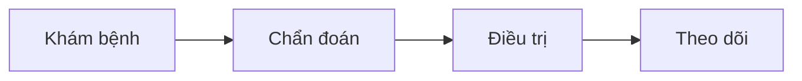
```mermaid
graph LR
    A[Khám bệnh] --> B[Chẩn đoán]
    B --> C[Điều trị]
    C --> D[Theo dõi]
```
```

Kết quả


```mermaid
graph LR
    A[Khám bệnh] --> B[Chẩn đoán]
    B --> C[Điều trị]
    C --> D[Theo dõi]
```

**Sơ đồ trình tự (Sequence):**

```
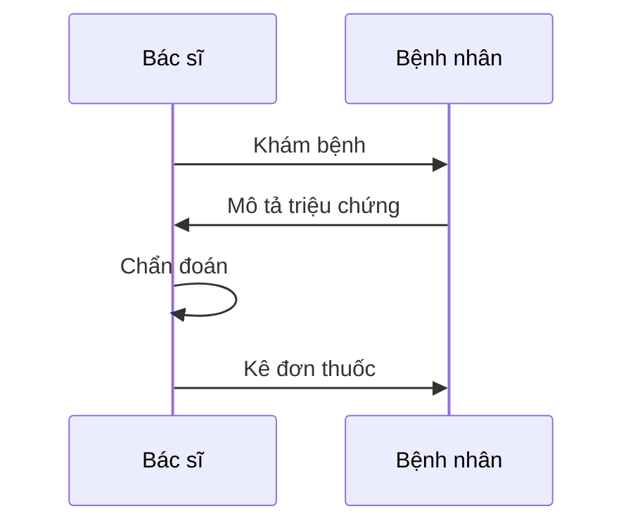
```mermaid
sequenceDiagram
    participant BS as Bác sĩ
    participant BN as Bệnh nhân
    BS->>BN: Khám bệnh
    BN->>BS: Mô tả triệu chứng
    BS->>BS: Chẩn đoán
    BS->>BN: Kê đơn thuốc
```
```

Kết quả


```mermaid
sequenceDiagram
    participant BS as Bác sĩ
    participant BN as Bệnh nhân
    BS->>BN: Khám bệnh
    BN->>BS: Mô tả triệu chứng
    BS->>BS: Chẩn đoán
    BS->>BN: Kê đơn thuốc
```

**Sơ đồ tổ chức (Organization):**

```
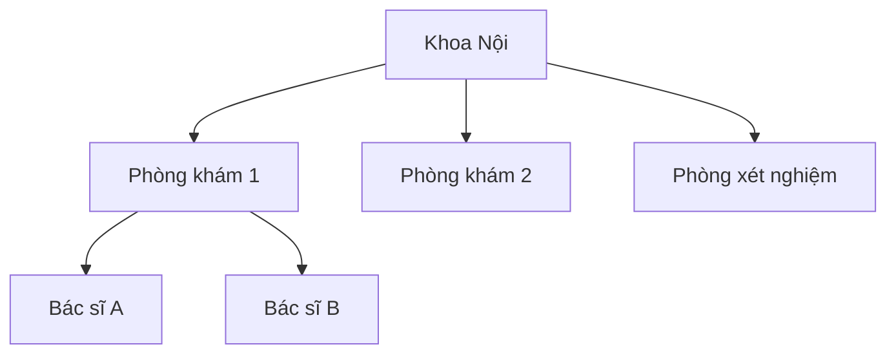
```mermaid
graph TD
    A[Khoa Nội] --> B[Phòng khám 1]
    A --> C[Phòng khám 2]
    A --> D[Phòng xét nghiệm]
    B --> E[Bác sĩ A]
    B --> F[Bác sĩ B]
```
```

Kết quả


```mermaid
graph TD
    A[Khoa Nội] --> B[Phòng khám 1]
    A --> C[Phòng khám 2]
    A --> D[Phòng xét nghiệm]
    B --> E[Bác sĩ A]
    B --> F[Bác sĩ B]
```

**Tại sao sử dụng Mermaid:**
- **Không cần phần mềm vẽ**: Chỉ cần viết văn bản
- **Dễ dàng cập nhật**: Sửa văn bản là sơ đồ thay đổi ngay
- **Hỗ trợ tốt trên GitHub**: Hiển thị đẹp và chuyên nghiệp
- **Tương thích cao**: Có thể sử dụng ở nhiều nơi khác

**Lưu ý khi sử dụng:**
- Bắt đầu với *\```mermaid* và kết thúc bằng *\```*
- Sử dụng các từ khóa như `graph`, `sequenceDiagram`
- Có thể thêm emoji và màu sắc để làm đẹp
- GitHub sẽ tự động hiển thị sơ đồ khi commit

**Ví dụ đơn giản:**
```
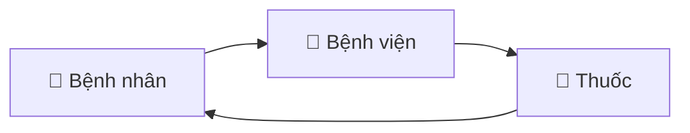
```mermaid
graph LR
    A[👤 Bệnh nhân] --> B[🏥 Bệnh viện]
    B --> C[💊 Thuốc]
    C --> A
```
```

Kết quả


```mermaid
graph LR
    A[👤 Bệnh nhân] --> B[🏥 Bệnh viện]
    B --> C[💊 Thuốc]
    C --> A
```

### 9.4. Cài đặt GitHub Desktop

1. Mở trang [Download GitHub Desktop](https://docs.github.com/en/desktop/installing-and-authenticating-to-github-desktop/installing-github-desktop), click *Download GitHub Desktop* button.
  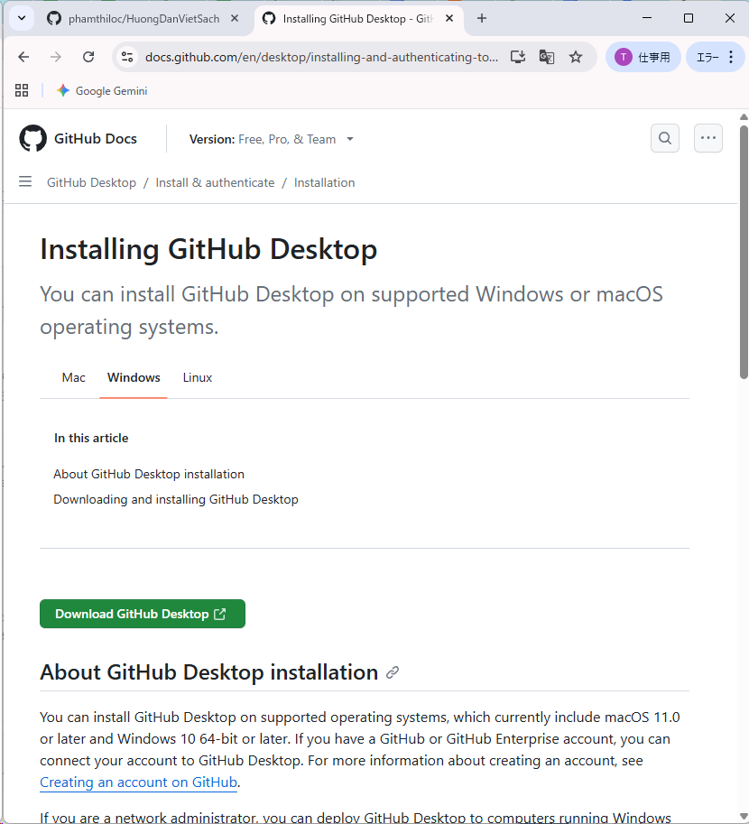
1. Click *Download now* button.
  
1. Click *Download for Window* button.
  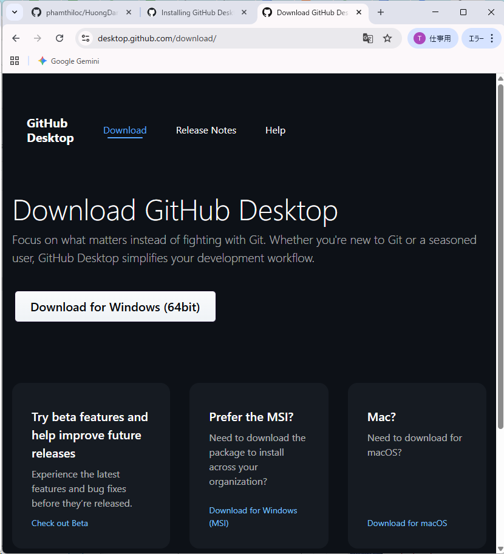
1. Sau khi download chương trình cài đặt (GitHubDesktopSetup-x64.exe trên Windows PC), chạy nó, click vào button "Sign in to GitHub\.com"
  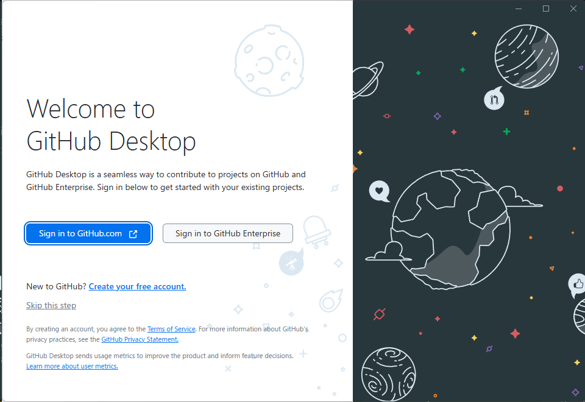
3. Web browser sẽ mở ra, login vào GitHub bằng account đã đăng ký.
  Màn hình hiển thị có thể khác tùy vào trạng thái bạn đang login GitHub trên web như thế nào.
  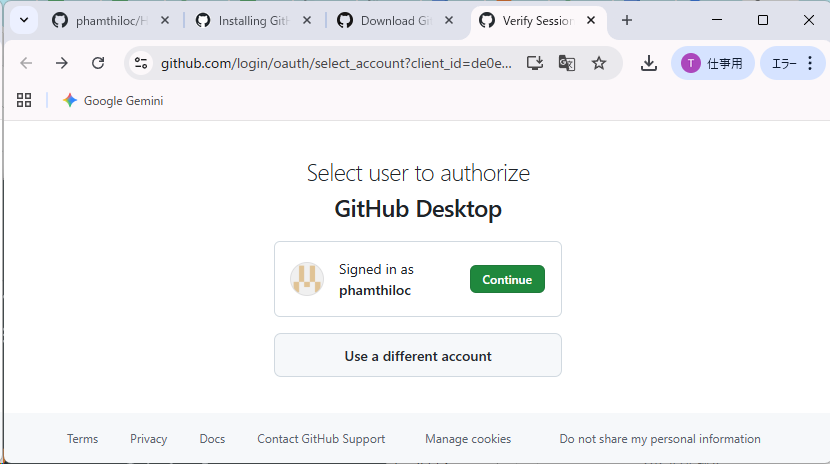
1. Sau khi login vào GitHub trên web, click button "Authorize desktop"
  
3. Click button "Confirm"
  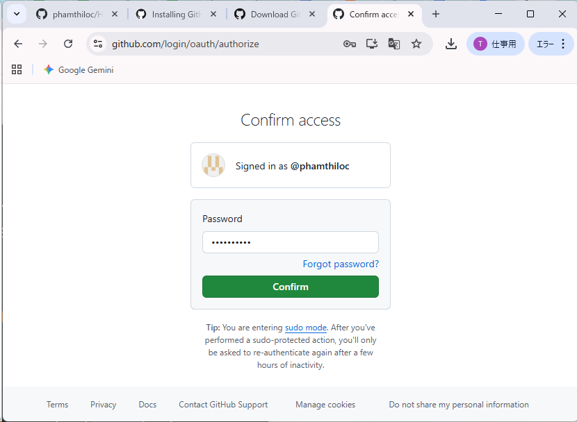
5. Khi được hỏi có mở chương trình "GitHubDesktop" hay không, click button "Open"
  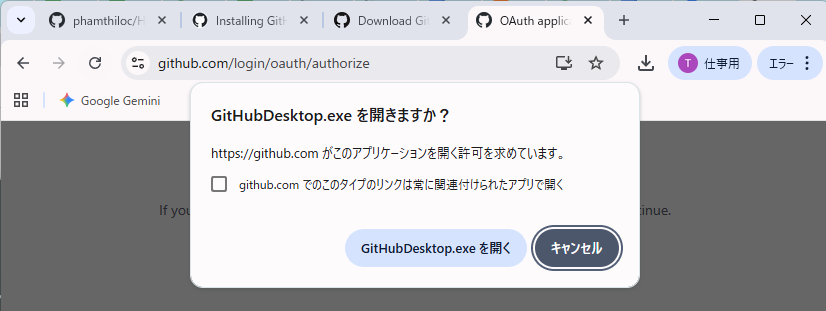
7. Trên màn hình "GitHub Desktop", click button "Finish"
  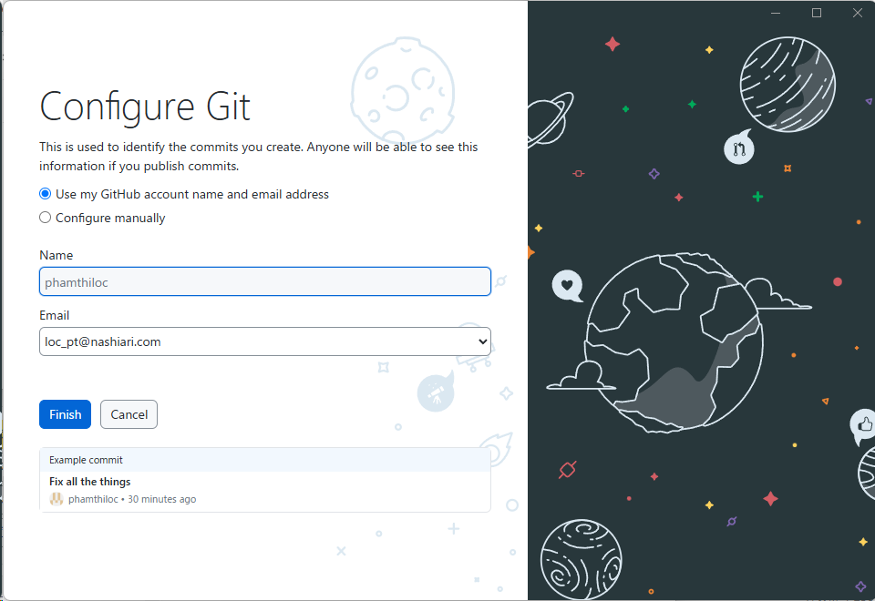
9. Đến đây, việc cài đặt GitHub Desktop hoàn tất
  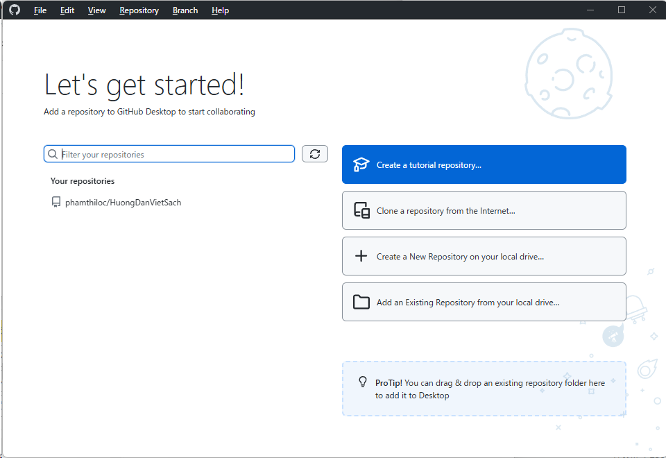


### 9.5. Tạo repository trên GitHub.com

* Login vào GitHub.com.
* Click button "Create repository"
  
* Nhập "Repository name" rồi click "Create repository" button.
  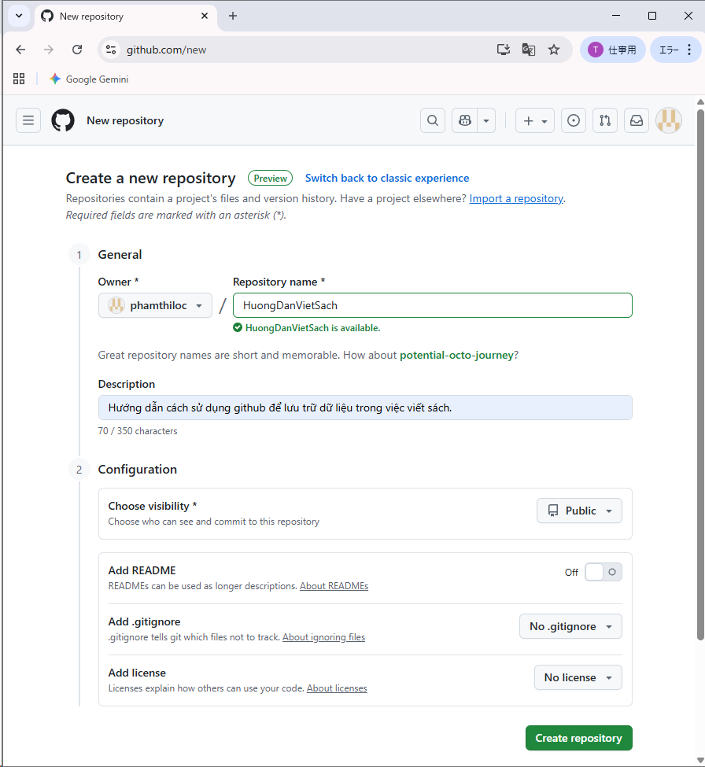
* Repository đã được tạo ra.
  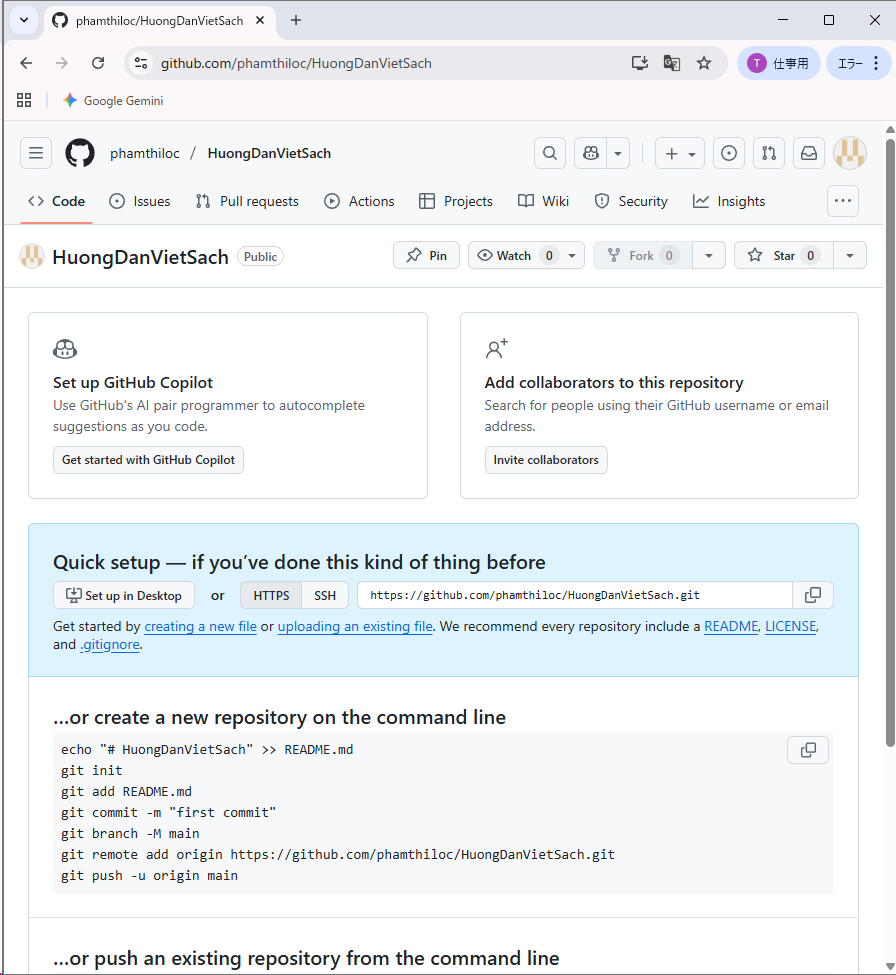

### 9.6. Clone repository

* Trong GitHub Desktop sẽ liệt kê các repository trong phần "Your repositories". Chọn repository muốn clone về máy tính, rồi click button "Clone <tên repository>".
  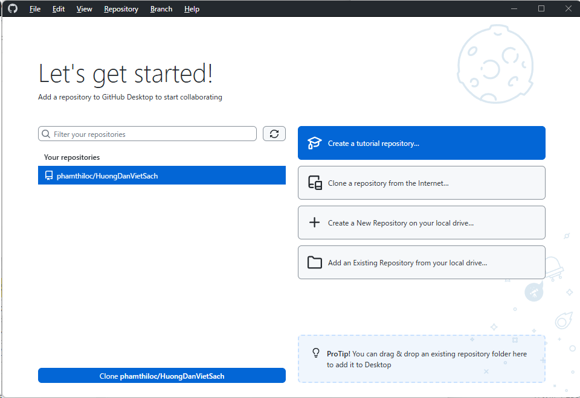
* Chỉ định thư mục trên máy tính nơi ta muốn download data về, rồi click button "Clone".
  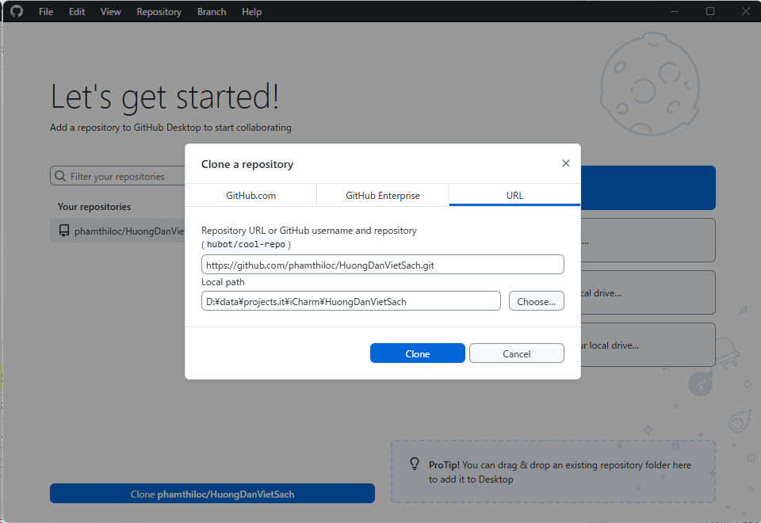
* Data đã được download về máy PC.
  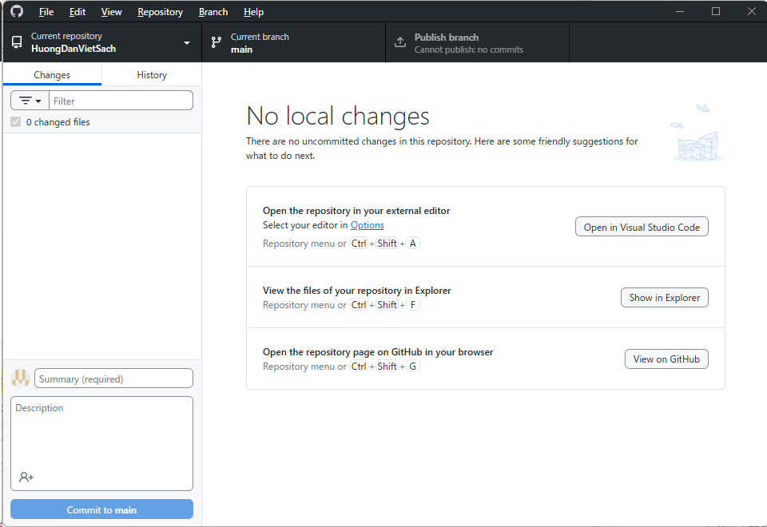
* Khi mở bằng file explorer, ta sẽ thấy có các file được download về (trong hình không có file nào vì chưa có data, trừ thư mục .git)
  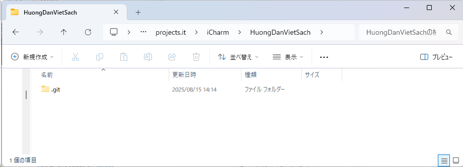

### 9.7. Commit và Push

* Khi mở GitHub Desktop và chọn repository làm việc, ta sẽ nhìn thấy danh sách các file bị thay đổi.
  
* Chọn các file muốn "Commit" vào local repository, rồi click button "Commit".
  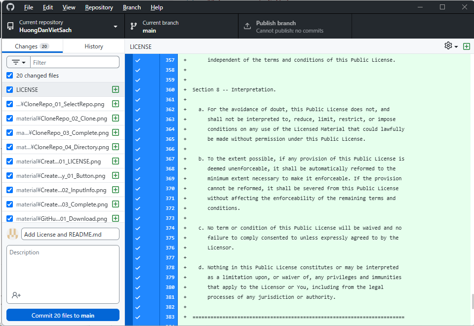
* Click button "Push origin" để đẩy data từ local repository lên GitHub.com
  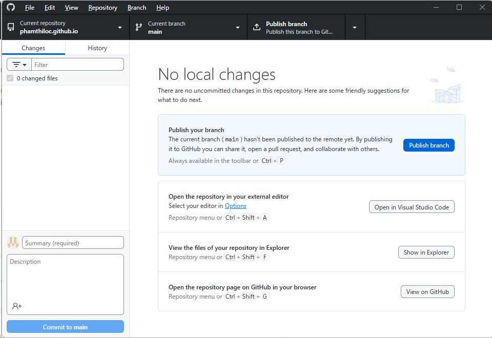
