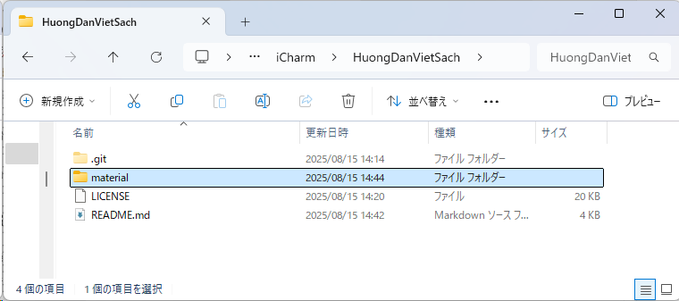

# Sử dụng github

## 1. Khái niệm về git và github

### 1.1. Khái niệm về git

TBD

### 1.2. Khái niệm về Github

TBD

### Viết tài liệu với Markdown

TBD

### 1.3. GitHub Desktop

[Download GitHub Desktop](https://docs.github.com/en/desktop/installing-and-authenticating-to-github-desktop/installing-github-desktop) và cài đặt trên máy của bạn.

TBD

### Visual Studio Code editor

Visual Studio Code là một chương trình soạn thảo văn bản, có thể cho phép ta soạn thảo file Markdown (.md) và nhìn được kết quả hiển thị trong lúc đang soạn thảo.

Download Visual Studio Code [tại đây](https://code.visualstudio.com/)

### 1.4. Quy trình làm việc với github

* Bước đầu: Clone repository.
* Mỗi lần làm việc:
  * Pull data.
  * Commit data.

## Quy tắc đặt tên

Tên file ảnh: `<Nhóm việc>_<number>_<Chú thích>.<extension>`, hoặc có thể chia vào các thư mục `<Nhóm việc>/<number>_<Chú thích>.<extension>`

* *<Nhóm việc>* là dễ phân tách các file ảnh theo nội dung sách, cho dễ quản lý.
* *<number\>* là số thứ tự, theo thứ tự xuất hiện trong sách. Cái này chỉ cần tính tương đối, không cần chặt chẽ (ví dụ trong tương lai ta có thể chèn thêm các ảnh vào cùng số thứ tự 04).
* *<Chú thích>* là từ gợi nhớ để ta dễ hiểu nội dung ảnh mà không cần mở nó ra. Nên đặt tên file kiểu CamelCase (viết hoa chữ đầu của từ).
* *<extension\>* là đuôi file ảnh, ví dụ như: jpg, jpeg, png…

Ví dụ
* CreateRepository_00_Button.png
* CreateRepository_01_InputInfo.png
* CreateRepository_02_Complete.png
* GitHubDesktop_01_Download.png
* GitHubDesktop_02_DownloadNow.png
* GitHubDesktop_03_DownloadForWindows.png

## Làm việc với Github

### Tạo repository

Với mỗi một dự án/quyển sách, chúng ta tạo cho nó một repository.
Trên github, bấm “Create repository”

### Clone repository về máy tính

TBD

* Trong thư mục được clone về, có thư mục .git. Ta không nên động vào các file trong thư mục này, cũng không được xóa nó.
* Sau khi đã clone repository, ta cần tạo ít nhất là 2 file *LICENSE* và *README\.md*
  

### Tạo file LICENSE

Nên tạo file LICENSE để tạo cơ sở pháp lý bảo về quyền sở hữu của mình trước các tranh chấp trong tương lai.

Với các tài liệu viết sách, ta nên lựa chọn giấy phép *Creative Commons Attribution-NonCommercial-NoDerivatives* (CC BY-NC-ND).

Xem nội dung chi tiết về giấy phép CC BY-NC-ND trong phụ lục.

### Tạo file README\.md

File *README\.md* là file được tự động hiển thị lên mỗi khi ta mở một thư mục trên GitHub. Ta nên để các hướng dẫn tổng quan liên quan đến các nội dung chứa trong thư mục này trong file README\.md.

## Phụ lục

### Giấy phép CC BY-NC-ND

CC BY-NC-ND là loại giấy phép hạn chế nhất trong số các giấy phép Creative Commons. Nó cho phép người khác sử dụng tác phẩm của bạn, nhưng đi kèm với ba điều kiện chính:
* *Attribution (Ghi công - BY)*: Đây là điều kiện cơ bản và bắt buộc cho mọi giấy phép Creative Commons. Bất kỳ ai sử dụng tác phẩm của bạn đều phải ghi công cho bạn với tư cách là tác giả gốc. Điều này bao gồm việc cung cấp tên tác giả, liên kết đến giấy phép và chỉ ra nếu có bất kỳ thay đổi nào về mặt kỹ thuật.
* *NonCommercial (Phi thương mại - NC)*: Điều kiện này cấm người khác sử dụng tác phẩm của bạn cho mục đích thương mại. Họ không thể bán, quảng cáo hoặc kiếm tiền từ tác phẩm của bạn.
* *NoDerivatives (Không phái sinh - ND)*: Điều này có nghĩa là bạn không cho phép người khác chỉnh sửa, chuyển đổi hoặc tạo ra một tác phẩm mới dựa trên tác phẩm gốc của bạn. Họ chỉ có thể sao chép và phân phối tác phẩm ở dạng nguyên bản.

Tóm lại, giấy phép *CC BY-NC-ND* cho phép người khác chia sẻ tác phẩm của bạn, nhưng chỉ khi họ *ghi công bạn, không sử dụng cho mục đích thương mại và không thay đổi tác phẩm gốc*.