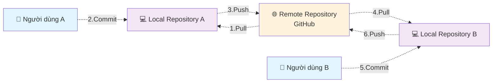

# Sử dụng GitHub để lưu trữ ảnh cho tài liệu

## Tổng quan

Tài liệu này hướng dẫn các kiến thức cơ bản để giúp sử dụng GitHub làm nơi lưu trữ tài nguyên (ảnh, checklist, biểu mẫu, protocol...) làm tài liệu tham khảo cho sách. Người đọc sách sẽ được chỉ dẫn để tìm đến các tài nguyên này trên internet (được lưu trữ trên GitHub).

## 1. Khái niệm

### 1.1. Khái niệm về git

Git là một hệ thống quản lý phiên bản (version control system) - giống như một "hồ sơ bệnh án điện tử" cho các file và thư mục trên máy tính. Hãy tưởng tượng Git như một hệ thống lưu trữ thông minh giúp bạn:

**Tác dụng của Git:**
- **Lưu trữ lịch sử thay đổi**: Giống như bác sĩ ghi chép từng bước điều trị, Git ghi lại mọi thay đổi trong file
- **Làm việc nhóm**: Nhiều người có thể cùng làm việc trên cùng một dự án mà không bị xung đột
- **Sao lưu an toàn**: Dữ liệu được lưu trữ ở nhiều nơi, giảm thiểu rủi ro mất mát
- **Quay lại phiên bản cũ**: Có thể khôi phục về bất kỳ thời điểm nào trong quá khứ

**Khái niệm Repository:**
- **Repository (Kho lưu trữ)**: Là nơi chứa tất cả file và thư mục của dự án, cùng với lịch sử thay đổi
- **Local Repository**: Repository được lưu trữ trên máy tính cá nhân của bạn
- **Remote Repository (GitHub)**: Repository được lưu trữ trên internet (máy chủ của GitHub), có thể truy cập từ bất kỳ đâu

**Các khái niệm cơ bản:**
- **Clone**: Sao chép toàn bộ repository từ GitHub về máy tính của bạn (giống như tải về một bộ hồ sơ hoàn chỉnh)
- **Pull**: Cập nhật dữ liệu mới nhất từ GitHub về máy tính (giống như đồng bộ hóa hồ sơ mới nhất)
- **Commit**: Lưu lại những thay đổi bạn đã thực hiện (giống như ghi chép vào hồ sơ bệnh án)
- **Push**: Gửi những thay đổi từ máy tính lên GitHub (giống như cập nhật hồ sơ lên hệ thống chung)

**Sơ đồ làm việc:**



Khi bạn thay đổi file trên máy tính, bạn "commit" để lưu lại. Sau đó "push" lên GitHub để chia sẻ với người khác. Người khác sẽ "pull" về để có được phiên bản mới nhất.


### 1.2. Khái niệm về Github

GitHub là một nền tảng lưu trữ và chia sẻ code trên internet - giống như một "thư viện y khoa trực tuyến" cho các dự án phần mềm và tài liệu. Hãy tưởng tượng GitHub như một kho lưu trữ khổng lồ trên internet:

**GitHub là gì:**
- **Nền tảng lưu trữ**: GitHub cung cấp không gian lưu trữ miễn phí cho các dự án của bạn trên internet
- **Cộng đồng chia sẻ**: Hàng triệu người trên thế giới sử dụng GitHub để chia sẻ và hợp tác
- **Giao diện web**: Bạn có thể truy cập GitHub qua trình duyệt web, không cần cài đặt phức tạp
- **Miễn phí**: Dịch vụ cơ bản hoàn toàn miễn phí cho cá nhân và dự án công khai

**Tại sao sử dụng GitHub:**
- **Lưu trữ an toàn**: Dữ liệu được lưu trữ trên máy chủ của Microsoft (chủ sở hữu GitHub), đảm bảo an toàn
- **Truy cập mọi lúc**: Có thể truy cập từ bất kỳ máy tính nào có internet
- **Chia sẻ dễ dàng**: Chỉ cần gửi link, người khác có thể xem và tải về
- **Làm việc nhóm**: Nhiều người có thể cùng làm việc trên cùng một dự án
- **Lịch sử đầy đủ**: Mọi thay đổi đều được ghi lại, có thể xem lại bất kỳ lúc nào

**So sánh với Git:**
- **Git**: Là công cụ quản lý phiên bản (như phần mềm quản lý hồ sơ bệnh án)
- **GitHub**: Là nơi lưu trữ và chia sẻ (như thư viện y khoa trực tuyến)

GitHub sử dụng Git làm nền tảng, nhưng cung cấp thêm nhiều tính năng như giao diện web, quản lý dự án, và cộng đồng chia sẻ.


### Viết tài liệu với Markdown

Markdown là một ngôn ngữ đánh dấu đơn giản để viết tài liệu - giống như một "hệ thống ghi chép thông minh" giúp bạn tạo ra văn bản có cấu trúc rõ ràng. Markdown được sử dụng rộng rãi trên GitHub để viết tài liệu hướng dẫn.

**Markdown là gì:**
- **Ngôn ngữ đánh dấu**: Một cách viết văn bản với các ký hiệu đặc biệt để tạo định dạng
- **Đơn giản**: Dễ học, dễ viết, không cần phần mềm phức tạp
- **Phổ biến**: Được sử dụng rộng rãi trên GitHub, các diễn đàn, và blog
- **Tương thích**: Có thể chuyển đổi thành nhiều định dạng khác (HTML, PDF...)

**Tại sao sử dụng Markdown:**
- **Dễ đọc**: Ngay cả khi chưa được hiển thị, văn bản vẫn dễ đọc
- **Dễ viết**: Không cần chuột, chỉ cần bàn phím
- **Nhất quán**: Hiển thị giống nhau trên mọi nền tảng
- **Hỗ trợ tốt**: GitHub hiển thị Markdown đẹp và chuyên nghiệp

**Lưu ý khi sử dụng trên GitHub:**
- File Markdown có đuôi `.md` (ví dụ: `README.md`)
- GitHub tự động hiển thị file README.md khi mở repository
- Có thể xem trước kết quả khi viết trên GitHub
- Hỗ trợ emoji và bảng biểu

Hãy xem thêm "Các ký hiệu cơ bản của Markdown" trong phần phụ lục.

### 1.3. GitHub Desktop

[Download GitHub Desktop](https://docs.github.com/en/desktop/installing-and-authenticating-to-github-desktop/installing-github-desktop) và cài đặt trên máy của bạn.

TBD

### Visual Studio Code editor

Visual Studio Code là một chương trình soạn thảo văn bản, có thể cho phép ta soạn thảo file Markdown (.md) và nhìn được kết quả hiển thị trong lúc đang soạn thảo.

Download Visual Studio Code [tại đây](https://code.visualstudio.com/)

### 1.4. Quy trình làm việc với github

* Bước đầu: Clone repository.
  Chỉ cần làm một lần.
* Mỗi lần làm việc:
  * Pull data.
  * Thay đổi data (thay đổi nội dung, hình ảnh, file...).
  * Commit data.
  * Push data.

## Quy tắc đặt tên

Tên file ảnh: chia vào các thư mục `<Nhóm việc>/<number>_<Chú thích>.<extension>`

* *<Nhóm việc>* là dễ phân tách các file ảnh theo nội dung sách, cho dễ quản lý.
* *<number\>* là số thứ tự, theo thứ tự xuất hiện trong sách. Cái này chỉ cần tính tương đối, không cần chặt chẽ (ví dụ trong tương lai ta có thể chèn thêm các ảnh vào cùng số thứ tự 04).
* *<Chú thích>* là từ gợi nhớ để ta dễ hiểu nội dung ảnh mà không cần mở nó ra. Nên đặt tên file kiểu CamelCase (viết hoa chữ đầu của từ).
* *<extension\>* là đuôi file ảnh, ví dụ như: jpg, jpeg, png…

Ví dụ
* CreateRepository/00_Button.png
* CreateRepository/01_InputInfo.png
* CreateRepository/02_Complete.png
* GitHubDesktop/01_Download.png
* GitHubDesktop/02_DownloadNow.png
* GitHubDesktop/03_DownloadForWindows.png

## Làm việc với Github

### Tạo repository

Với mỗi một dự án/quyển sách, chúng ta tạo cho nó một repository.
Trên github, bấm “Create repository”

### Clone repository về máy tính

TBD

* Trong thư mục được clone về, có thư mục .git. Ta không nên động vào các file trong thư mục này, cũng không được xóa nó.
* Sau khi đã clone repository, ta cần tạo ít nhất là 2 file *LICENSE* và *README\.md*
  

### Tạo file LICENSE

Nên tạo file LICENSE để tạo cơ sở pháp lý bảo về quyền sở hữu của mình trước các tranh chấp trong tương lai.

Với các tài liệu viết sách, ta nên lựa chọn giấy phép *Creative Commons Attribution-NonCommercial-NoDerivatives* (CC BY-NC-ND).

Xem nội dung chi tiết về giấy phép CC BY-NC-ND trong phụ lục.

### Tạo file README\.md

File *README\.md* là file được tự động hiển thị lên mỗi khi ta mở một thư mục trên GitHub. Ta nên để các hướng dẫn tổng quan liên quan đến các nội dung chứa trong thư mục này trong file README\.md.

## Phụ lục

### Giấy phép CC BY-NC-ND

CC BY-NC-ND là loại giấy phép hạn chế nhất trong số các giấy phép Creative Commons. Nó cho phép người khác sử dụng tác phẩm của bạn, nhưng đi kèm với ba điều kiện chính:
* *Attribution (Ghi công - BY)*: Đây là điều kiện cơ bản và bắt buộc cho mọi giấy phép Creative Commons. Bất kỳ ai sử dụng tác phẩm của bạn đều phải ghi công cho bạn với tư cách là tác giả gốc. Điều này bao gồm việc cung cấp tên tác giả, liên kết đến giấy phép và chỉ ra nếu có bất kỳ thay đổi nào về mặt kỹ thuật.
* *NonCommercial (Phi thương mại - NC)*: Điều kiện này cấm người khác sử dụng tác phẩm của bạn cho mục đích thương mại. Họ không thể bán, quảng cáo hoặc kiếm tiền từ tác phẩm của bạn.
* *NoDerivatives (Không phái sinh - ND)*: Điều này có nghĩa là bạn không cho phép người khác chỉnh sửa, chuyển đổi hoặc tạo ra một tác phẩm mới dựa trên tác phẩm gốc của bạn. Họ chỉ có thể sao chép và phân phối tác phẩm ở dạng nguyên bản.

Tóm lại, giấy phép *CC BY-NC-ND* cho phép người khác chia sẻ tác phẩm của bạn, nhưng chỉ khi họ *ghi công bạn, không sử dụng cho mục đích thương mại và không thay đổi tác phẩm gốc*.

### Các ký hiệu cơ bản của Markdown

**Tiêu đề:**
```
# Tiêu đề lớn nhất
## Tiêu đề nhỏ hơn
### Tiêu đề nhỏ hơn nữa
```

**Văn bản:**
```
*In nghiêng* hoặc _In nghiêng_
**In đậm** hoặc __In đậm__
`Mã code`
```

**Danh sách:**
```
- Mục 1
- Mục 2
  - Mục con 2.1
  - Mục con 2.2

1. Mục số 1
2. Mục số 2
```

**Liên kết và ảnh:**
```
[Liên kết](https://github.com)

```

**Trích dẫn:**
```
> Đây là phần trích dẫn
> Có thể viết nhiều dòng
```

**Mã code:**
```
`Mã ngắn`

```
Mã dài
nhiều dòng
```
```