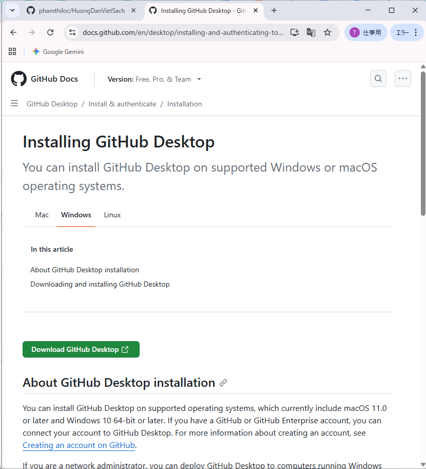
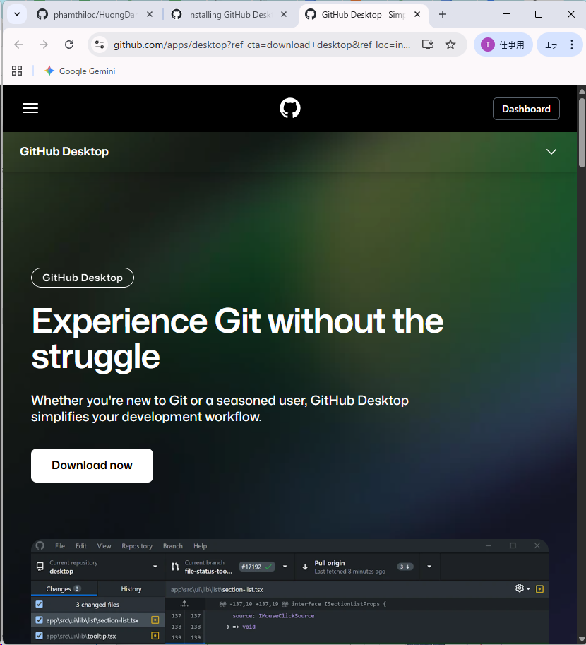
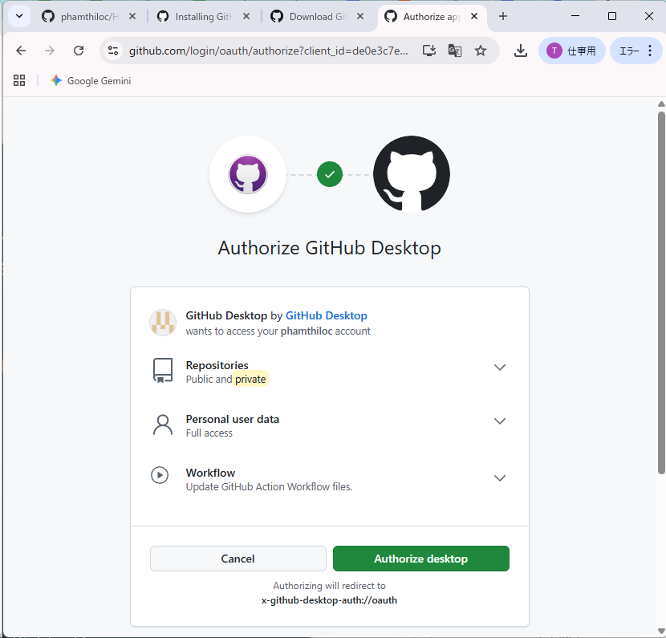
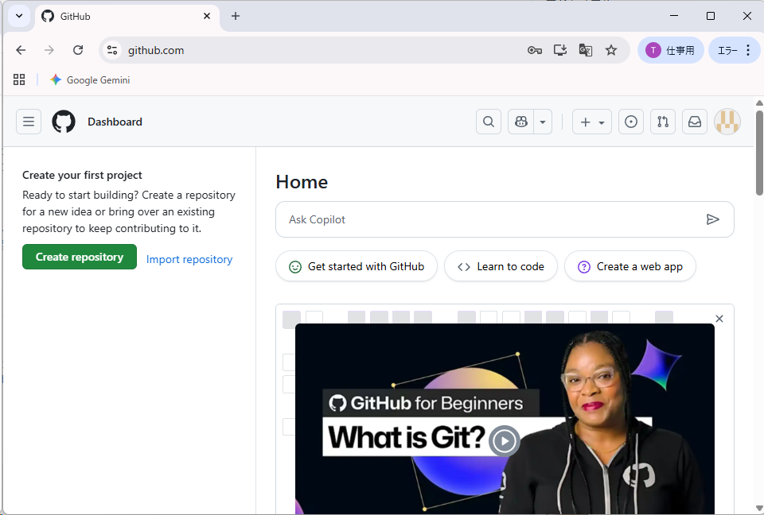
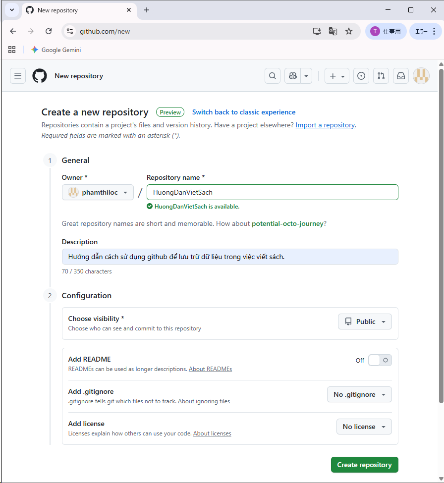
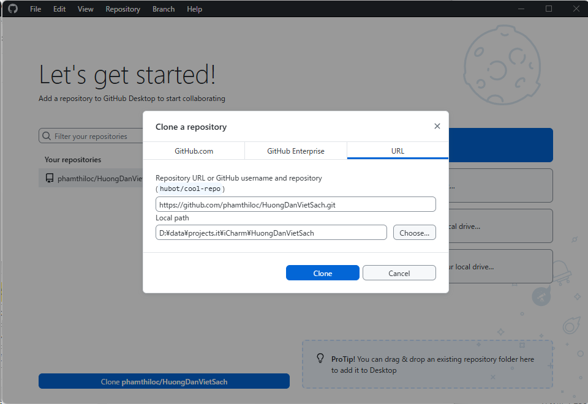
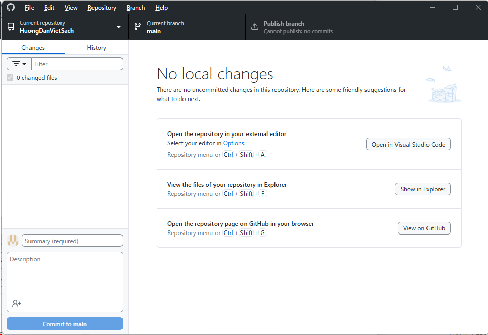
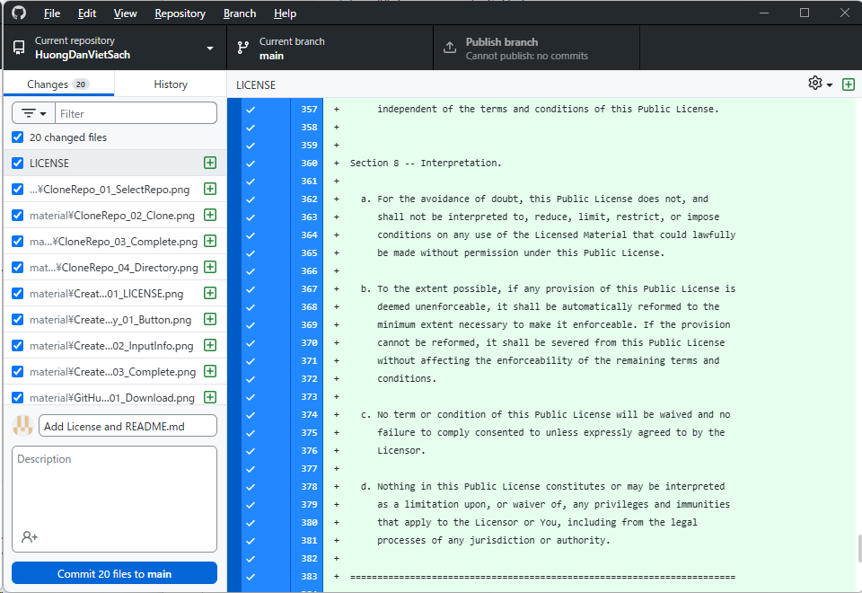

# Ví dụ về trang danh sách các ảnh

## Tổng quan

Đây là ví dụ về trang danh sách các ảnh.
Đây có thể là file .md, cũng có thể là file .md.
Nó được accesss thông qua GitHub page [https://phamthiloc.github.io/HuongDanVietSach/SampleImageList.html](https://phamthiloc.github.io/HuongDanVietSach/SampleImageList.html).

QR code của nó

## Chương 1: Cài đặt GitHub Desktop

1. Hình 1-1: Download GitHub Desktop
  
1. Hình 1-2: Download now.
  
1. Hình 1-3: Download for Windows.
  
1. Hình 1-4: Sign in to GitHub\.com
  
3. Hình 1-5: Authorize
  
1. Hình 1-6: Authorize desktop
  
3. Hình 1-7: Confirm
  
5. Hình 1-8: Open
  
7. Hình 1-9: Finish
  
9. Hình 1-10: Let's get started!
  

## Chương 2: Tạo repository trên GitHub.com

* Hình 2-1: Create repository
  
* Hình 2-2: Input information
  
* Hình 2-3: Complete
  

## Chương 3: Clone repository

* Hình 3-1: Clone <tên repository>
  
* Hình 3-2: Clone
  
* Hình 3-3: Complete
  
* Hình 3-4: File explorer
  

## Chương 4: Commit và Push

* Hình 4-1: License.
  
* Hình 4-2: Commit.
  
* Hình 4-3: Publish.
  
